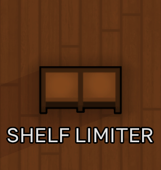

<h1 align="center">Shelf Limiter</h1>

  

**Shelf Limiter is a RimWorld 1.6 mod that lets players set a separate maximum amount for every resource stored on a vanilla shelf.**

## Features

- Set a separate maximum for every resource.
- Leave a field empty to preserve normal vanilla behavior.
- Limits apply across the entire selected shelf.
- Values automatically cap at that resource's physical shelf capacity.
- Lowering a limit makes only the excess amount eligible for hauling.
- Accounts for items that pawns are already carrying to the shelf.
- Limits persist in saved games.
- Affects only the vanilla `Shelf` and `ShelfSmall` buildings.

Stockpile zones, dumping zones, containers, and modded storage buildings are not changed.

## Requirements

- RimWorld 1.6
- [Harmony](https://steamcommunity.com/sharedfiles/filedetails/?id=2009463077)

## Installation

1. Download the latest release.
2. Extract the `Shelf Limiter` folder into RimWorld's `Mods` directory.
3. Enable Harmony and Shelf Limiter in the mod list.
4. Keep Harmony above Shelf Limiter in the load order.

## Usage

Select a vanilla shelf and open its **Storage** tab. Enter a number beside any resource to set its maximum. Clear the field to remove the limit.

If a shelf already contains more than the new maximum, pawns can haul the excess to another valid storage destination. RimWorld must have somewhere else that accepts the resource and has free space.

## Compatibility

Shelf Limiter uses Harmony patches and does not replace vanilla definitions. Mods that heavily rewrite the storage filter interface or hauling logic may require compatibility work.

## License

The original Shelf Limiter source code is available under the [MIT License](LICENSE). RimWorld and any visual elements derived from it belong to Ludeon Studios. See [THIRD-PARTY-NOTICES.md](THIRD-PARTY-NOTICES.md).
